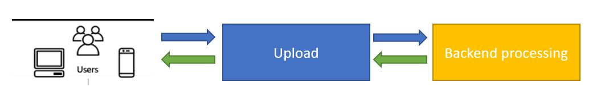
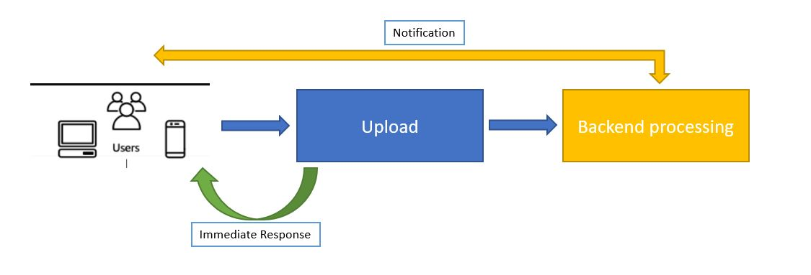
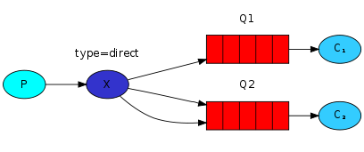
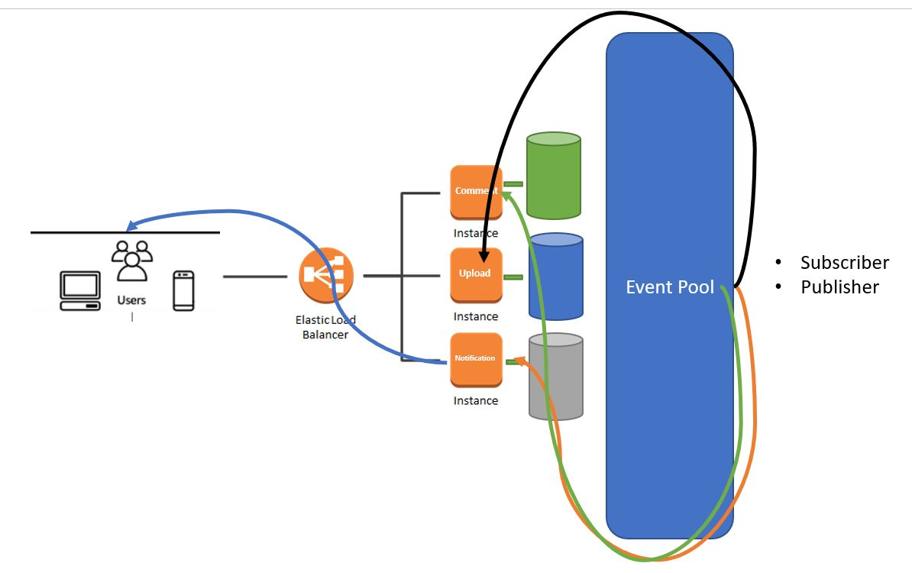
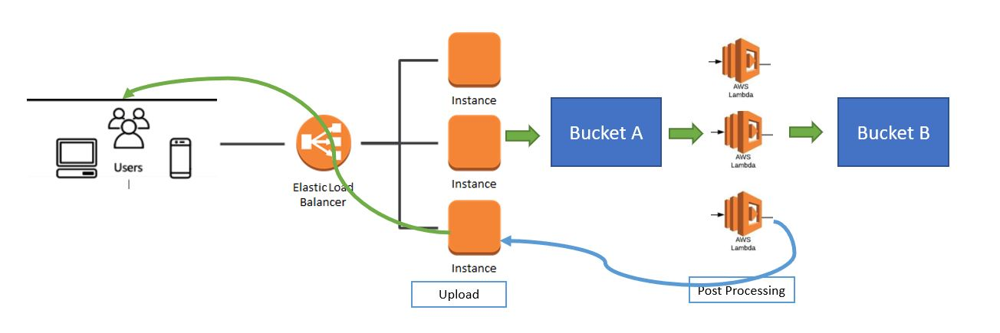
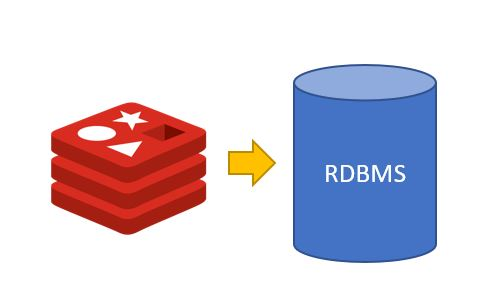

# Imagegram
## Introduction
This repository is a RESTful API inspired by a system that allows you to upload images and comment on them. There's a mixture of application being built together in one system architecture.
## Technology stacks
1. .NET 5 - Containerized server application
2. NodeJS - Lambda function
3. MySQL  - RDBMS
## Core requirement
1. Large image size up to 100MB upload
2. Image file conversion
3. Low latency query
## System design perspective
### User Behaviour:
#### 1. Synchronous Approach:


1. User submit the photo upload to our API.
2. API received upload request and push image to S3-raw.
3. Once push completed, API make a request to spin off a lambda function to perform image format conversion.
4. Once conversion completed, lambda function feedback with response to API and update the database with new record.
5. Upon successful update, API respond back to user saying your image has been successfully uploaded

**Simplified flow:**
<br>
User -> API (upload) -> Lambda (formatting) -> API (update) -> User

This approach allowed user to have immediate feedback on their photo upload to the server. However, user may feel impatient if their internet connectivity is slow because they have to wait util the whole process to be completed.

#### 2. Asynchronous Approach:


1. User submit the photo upload to our API.
2. Upon submission, the user will directly received a non-blocking response of the upload. User may continue to browse or do other stuff with the client app.
3. API received request then push image to S3-raw.
4. S3-raw will trigger a lambda to perform file conversion.
5. Upon successful of file conversion, lambda send sqs msg to a msg queue that subcribed by our API service
6. API service notified by polling the subscribed msg queue and send notification back to the user.
7. User notified with a notification saying your image has been succesfully uploaded.

**Simplified flow:**
<br>
User -> API (upload) (decoupled)-> Lambda (formatting) -> API (update) -> User

This approach may have different user experience as in user cannot perform cancellation in the middle of the process. However, this is able to resolve problems that poor internet connection users are facing. Beside, this design enable our backend system process to be decoupled and offload to more different resources for faster processing.

### Application & Infrastructure
#### 1. Horizontal Scaling Approach:

This approach can be used for both sync and async behaviour.

1. The backbone of this design is based on a horizontal scaling of monolith application behind a load balancer.
2. The applicaton is still monolith because all the APIs are packed in a same service and having concurrent transaction with the same database.
3. This apporach is the most conventional approach for most enterprises because it fulfilled the ACID compliants where data consistency among services and database are persisted.

#### 2. Serverless Approach:

This approach uses fully serverless application and be used for both sync and async as well.

1. This approach is much more easier and straightforward when comes in handling inconsistency traffic load. This is because Lambda function itself is a stateless isolated instance that perform small task very fast and efficient without intensive supervision.
2. The API Gateway can be seen as a trigger for respective lambda functions and also act as a load balancer for the http request as well.
3. However, there are limitations and trade-offs with this approach:
   - Usually database has its preset on the number of concurrent connection pool. This will be a problem if there is a high number of concurrent connection coming from the lambdas and the database will become exhausted as more connection requests are formed.
   - Lambda has short lifetime of 15mins and only accept small payload size. Its not recommended to handle certain blocking processing that is taking too long and will eventually causes a timeout such as the huge file upload for user with slow internet connectivity.

### MESSAGE QUEUES / BROKERS:

This illustrate a simple message queue with 2 different channels or topics having both publisher and consumer at the end. This will be the key element of the backbone of the event driven architecture.

#### 3. Event Sourcing Approach:

This approach implemented fully with the CQRS and event driven design mainly using event sourcing technique such as message queues and brokers.

1. We can observe that the services are fully isolated as in its individual micrservices.
2. Databases are splitted and all transactions are performed seperatedly by event.
3. Each services can be a subscriber / publisher.
4. Possible problems:
    - Data consistency may not applicable to ACID compliant (Eventual consistency)
    - Duplicated and missing messages

#### 4. IDEAL Approach (Mixture best of both world) - Async

This approach is a combination of both containerized services and lambda functions. I personally felt this should be the best design afterall of a scalable and robust system.

Components:
1. Containerized app services
2. Message queues / brokers / Dead-letter queues
3. Redis & RDBMS

The design is similar to the event driven approach. However, instead of seperating the database, we'll still prefer to stick with one centralised database. This approach may not be good for high frequency writes but there's a way to handle it using redis.



**Redis is a key-value database where it perform on top of high speed volative memory like RAM.**

1. It able to perform very fast write and read, however it has its limitation in its persistence storage. So, we'll be using it as a layer of queue when handling high load of adding comment requests then we make a period insert into our sql database. 
2. Although we may have a slight delay in the insertion, but its still minimal as compared with direct insertion of any direct api request.  

#### Synchronous approach:
1. User upload their image through REST protocol using multi-part upload to our containerized services (resolve large file timeout)
2. Once uploaded, containerized services trigger lambda using API-gateway to perform image format conversion (offload to lambda and better network connectivity within the same cloud env)
3. Lambda will response back to service client either fail or pass and perform database update together with sending back responses to client in real time.

## How to run ?
1. Checkout the repository and build the .Net 5 application using visual studio
2. Do remember to append your AWS credential in App.config file in the root directory of the workspace
3. Your service should be started immediately.

## API
Local host examples:
1. Image Upload: (POST)
```
http://localhost:8080/image/upload?file
```
| Param             | Description                              |
| -------------------- | ---------------------------------------- |
| `file`         | The file to upload  |

2. Add Comment: (POST)
   - Request body: {image_id,comment}
```
http://localhost:8080/comment
```
| Attribute             | Description                              |
| -------------------- | ---------------------------------------- |
| `image_id`         | The id of the image  |
| `comment` | The content of the comment |

3. Get all Posts : (GET)
   - (Optional) Cursor Pagination - Param (limit,nextCursor)

| Endpoint             | Description                              |
| -------------------- | ---------------------------------------- |
| `http://localhost:8080/post`         | Initial request. Return all the posts  |
| `http://localhost:8080/post/?limit=5&nextCursor=10` | Return only 5 posts starting from the 10th |
| `http://localhost:8080/post/?limit=5` | Return only 5 posts starting from the beginning |
