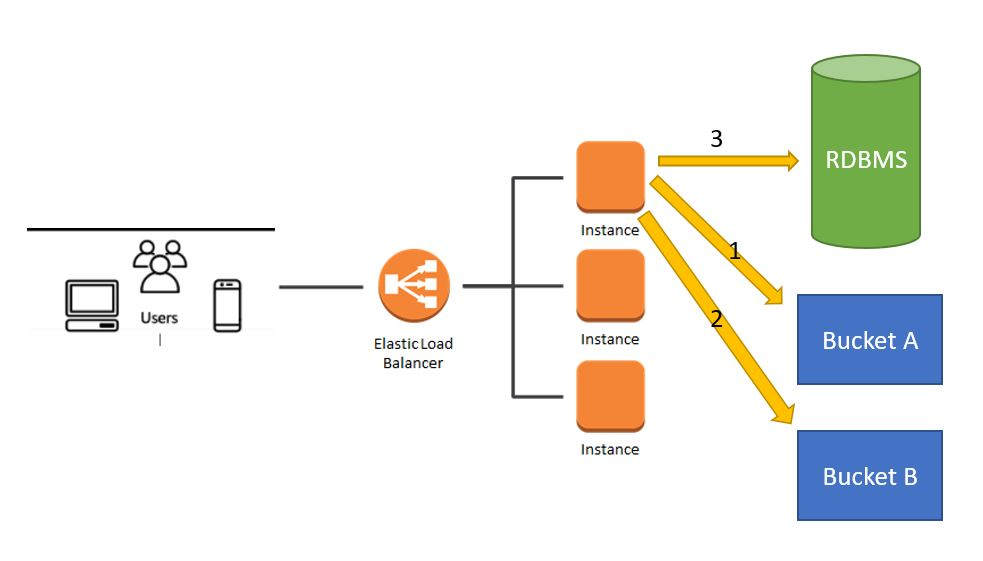
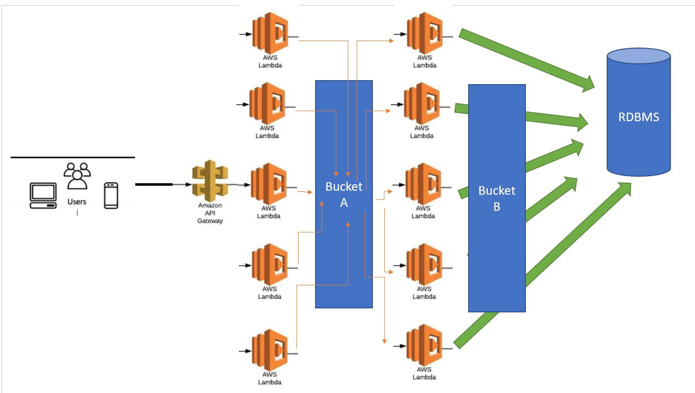
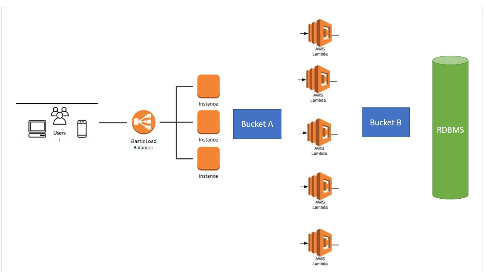

# Imagegram
## Introduction
This repository is a RESTful API inspired by a system that allows you to upload images and comment on them. There's a mixture of application being built together in one system architecture.
## Technology stacks
1. .NET 5 - Containerized server application
2. NodeJS - Lambda function
3. MySQL  - RDBMS
## Core requirement
1. Large image size up to 100MB upload
2. Image file conversion
3. Low latency query
## System design perspective
### Containerized App only

This approach is the most common microservice design to consume and handle high traffic environment.

#### Synchronous approach:
1. Perform horizontal scaling by increasing and decreasing number of instances based on traffic
2. Good in handling large file transfer through multi-part upload
3. The image upload is synchronous where users can know the status of their upload in real time.
4. However, this system is good if there's a consistency of high traffic all the time

### Serverless (async / sync)

This approach uses fully serverless application mainly lambda functions and apigateway

#### Synchronous approach:
1. The lambda functions will be upscaling by spinning new instances based on the load demand.
2. Almost no supervision is required for the upscaling
3. Lambda is triggered by incoming http request from the api-gateway then perform the file upload
   - There will be issue if the file is too large and the user network connection is slow and easily causes timeout all the time
4. Once finished uploaded the lambda will trigger another lambda to perform image format conversion and update the RBMS record once completed

#### ASynchronous approach:
1. This is actually my first thought of the design. However there are still a few challenges.
2. Api gateway trigger lambda perform upload and then once the upload is completed, s3 will trigger lambda to do file format conversion and update RDBMS
3. We can introduce message queue to keep track on the progress, if there's any failure in between we can either retry with dead letter queue or send a notification back to user saying your image is incompatible.
4. Due to the nature of its asynchronous approach, user cannot know whether their files are not corrupted or any issue in the middle of the process unless we establish a notification adapter over client side.

### My Approach (Mixture best of both world)

This approach is a combination of both containerize services and lambda functions.

#### Synchronous approach:
1. User upload their image through http protocol using multi-part upload to our containerized services (resolve large file timeout)
2. Once uploaded, containerized services trigger lambda using API-gateway to perform image format conversion (offload to lambda and better network connectivity within the same cloud env)
3. Lambda will response back to service client either fail or pass and perform database update together with sending back responses to client in real time.

## How to run ?
1. Checkout the repository and build the .Net 5 application using visual studio
2. Do remember to append your AWS credential in App.config file in the root directory of the workspace
3. Your service should be started immediately.

## API

